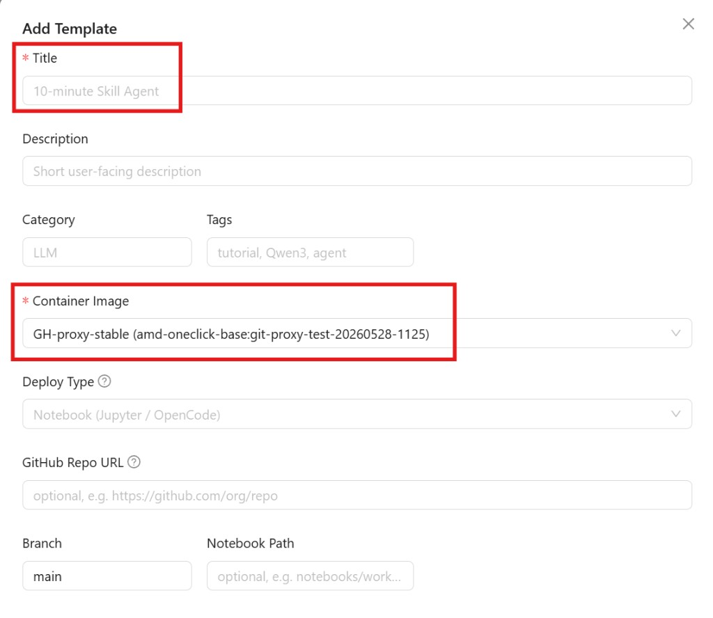

# Radeon Cloud User Guide

This guide walks you through the full flow on [Radeon Cloud](https://radeon-global.anruicloud.com/): get a cloud AMD Radeon GPU and get into your development environment.

---

## ⭐ Step 0 · Login

Open the Radeon Cloud website, click **Login** in the top-right corner, and choose **Login with Email**.

https://radeon-global.anruicloud.com/


---

## ⭐ Step 1 · Click Profile

After logging in, click your avatar in the top-right corner and choose **Profile** from the dropdown.


---

## ⭐ Step 2 · Add Template

In the **My Templates** section of the Profile page, click **Add Template** in the top-right, and create your own template in the form that pops up.


### ① Add Title

Give the template a name (Title, required).

### ② Choose Container Image

Choose a Container Image (required).



If you want your files to persist, set **Storage** to **Persistent (PVC)** — its data is kept even after the instance is destroyed. 

Click **Add Template** at the bottom to finish.

---

## ⭐ Step 3 · Launch template

Back in the **My Templates** list, click **Launch** on the row of the template you just created to start an instance.


---

## ⭐ Step 4 · Enter the environment (pick one of two ways)

### Option A · JupyterLab Terminal

Once the instance is ready and the dialog shows **Your workspace is ready (100%)**, click **Open Notebook**.


Your browser opens **JupyterLab** in a new tab — the instance's default access point. You get a full development environment right in the browser:

- **Terminal**: a full Linux terminal (click `+` at the top → Terminal, or the Terminal tile in the Launcher) for installing, downloading, and starting services
- **Notebook (.ipynb)**: a live document mixing code and output
- **File browser**: upload/manage files on the left (click the upload button `↑` to bring in your own `.ipynb`)


### Option B · SSH

**① Add your SSH public key in Profile**

- Generate a key pair locally (skip if you already have one). macOS / Linux / Windows PowerShell:

  ```bash
  ssh-keygen -t ed25519 -C "your_email@example.com"
  ```

  This creates `~/.ssh/id_ed25519` (private key) and `~/.ssh/id_ed25519.pub` (public key) by default.

- Copy the public key content (`cat ~/.ssh/id_ed25519.pub`), paste it into the **SSH Public Key** box on the Profile page, and click **Save Key**.


> ⚠️ Only paste the `.pub` **public key** — never paste the private key.

**② Enable SSH Access in Add Template**

When creating a template (Step 2), turn on the **SSH Access (advanced)** toggle at the bottom of the form before clicking Add Template. Only instances launched from SSH-enabled templates can be reached via SSH.


**Connect to the instance**

1. After the instance starts, the ready dialog (and the **Active Instance** section in Profile) shows **SSH access** — with a copy-ready **Command** and **Host : Port** (host, port, and username, as shown on the page).


2. Connect from a local terminal:

   ```bash
   ssh <user>@<host> -p <port>
   ```

   Replace `<user>`, `<host>`, and `<port>` with the actual values shown in the instance details; type `yes` when prompted to confirm the fingerprint on first connect.


> [!NOTE]
> Some images may not include an SSH server by default. If `sshd` is unavailable, install and start it manually in terminal:
```bash
sudo apt update
sudo apt install -y openssh-server
mkdir -p /run/sshd
which sshd
/usr/sbin/sshd
```
---

## ⭐ Using Model APIs (OpenAI-compatible)

Besides opening a notebook, Radeon Cloud can serve models behind an **OpenAI-compatible HTTP API**, so any OpenAI-compatible client (curl, the `openai` SDK, Cherry Studio, LangChain, …) can call them. There are two options.

### Option 1 · Free Model APIs (shared, no instance needed)

Ready-to-use shared endpoints — no GPU instance to launch, no credits spent. Currently **Qwen** and **DeepSeek** are available.

1. Open the **Token Factory** page and log in with your account:
   https://developer.amd.com.cn/radeon/modelapis


2. Under **Public Free Model APIs**, pick a model (Qwen or DeepSeek). The detail dialog shows the **Base URL**, the **Model** name, your **API Key**, and a ready-to-run **Quickstart (curl)**. Copy your API key.


3. Call it from any terminal (replace `<API_KEY>` with your key):

   ```bash
   curl https://developer.amd.com.cn/radeon/api/v1/chat/completions \
     -H "Authorization: Bearer <API_KEY>" \
     -H "Content-Type: application/json" \
     -d '{"model":"Qwen3.6-35B-A3B","messages":[{"role":"user","content":"Hello"}]}'
   ```

   The same key works for all shared models — just change the `model` field (e.g. `DeepSeek-V4-Flash`).

### Option 2 · Dedicated Model APIs (your own instance)

Deploy your own model as a dedicated OpenAI-compatible endpoint (uses your credits).

1. Go to https://radeon-global.anruicloud.com/ → **Profile** → **Add Template**.
2. Set **Deploy Type = vLLM Model API** (Radeon only supports vLLM), then fill in the required **Serve Command** yourself:


   - Write your own serve command following the format shown in the form (`vllm serve <model> --host 0.0.0.0 --port 8000`).
   - **Keep `--host 0.0.0.0 --port 8000`** — the platform routes the endpoint to port 8000.

3. Click **Add Template**, then **Launch** it from **My Templates**. When ready, the dialog shows a dedicated **Base URL** (`.../spaces/<id>/8000/v1`), **Model**, and **API Key** — call it exactly like Option 1, using this Base URL.

---

## ⭐ Destroy the instance when done

A running instance keeps consuming credits. When you're done, go to the **Active Instance** section in Profile and click the red **Destroy Instance** button to destroy it.


