# Radeon Cloud 使用指南

本指南带你在 [Radeon Cloud](https://radeon.anruicloud.com/) 上走一遍完整流程，拿到一张云端 AMD Radeon GPU 并进入开发环境。

---

## ⭐ Step 0 · 登录

打开 Radeon Cloud 网站。

https://radeon.anruicloud.com/

---

## ⭐ Step 1 · Click Profile

登录后点击右上角头像，在下拉菜单里选择 **Profile**。

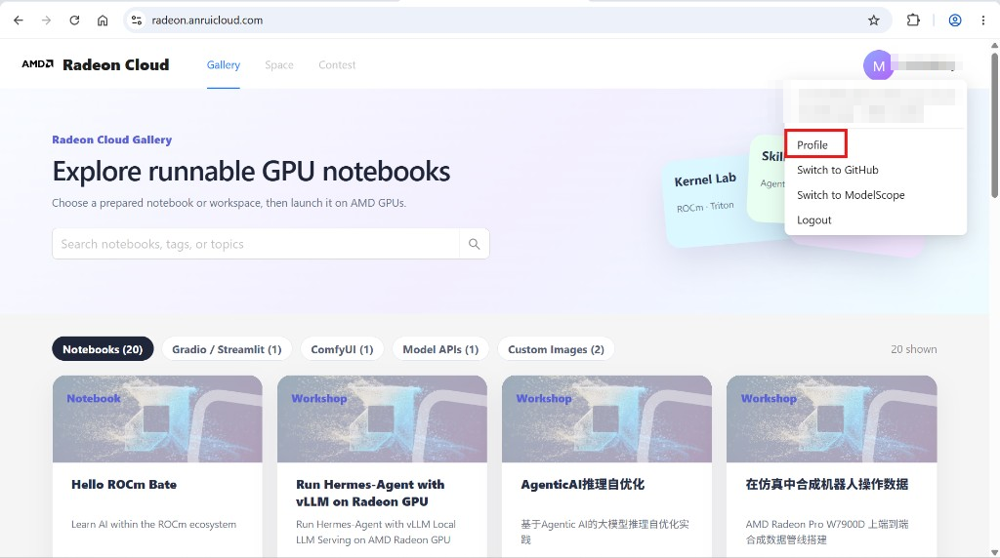

---

## ⭐ Step 2 · Add Template

在 Profile 页的 **My Templates** 区域，点击右上角 **Add Template**，在弹出的表单里创建一个自己的模板。

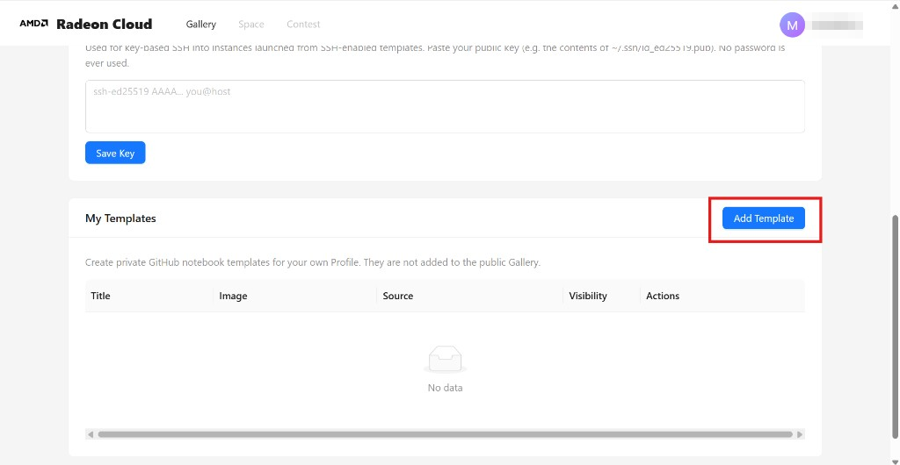

### ① Add Title

给模板起一个名字（Title，必填）。

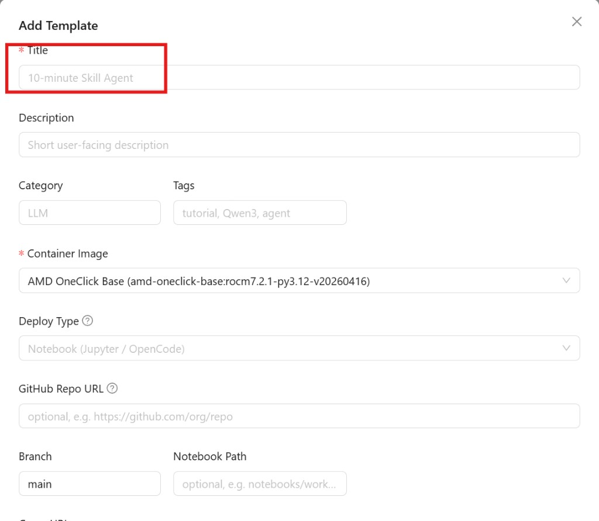

### ② Choose Container Image

选择容器镜像（Container Image，必填）。

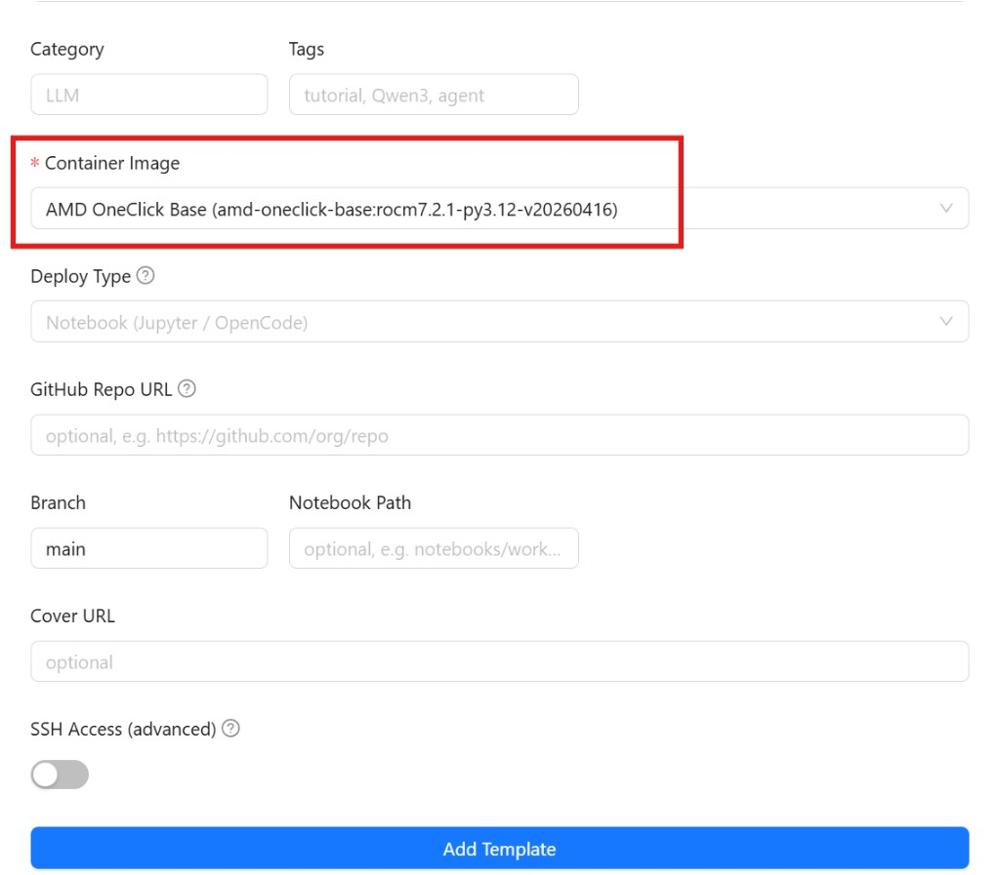

填完点击底部 **Add Template** 完成创建。

---

## ⭐ Step 3 · Launch template

回到 **My Templates** 列表，在刚创建的模板那一行点击 **Launch** 启动实例。

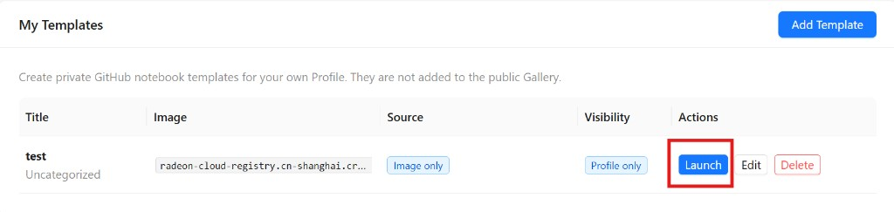

---

## ⭐ Step 4 · 进入环境（两种方式二选一）

### 方式 A · JupyterLab Terminal

等实例就绪，弹窗显示 **Your workspace is ready（100%）** 后，点击 **Open Notebook**。

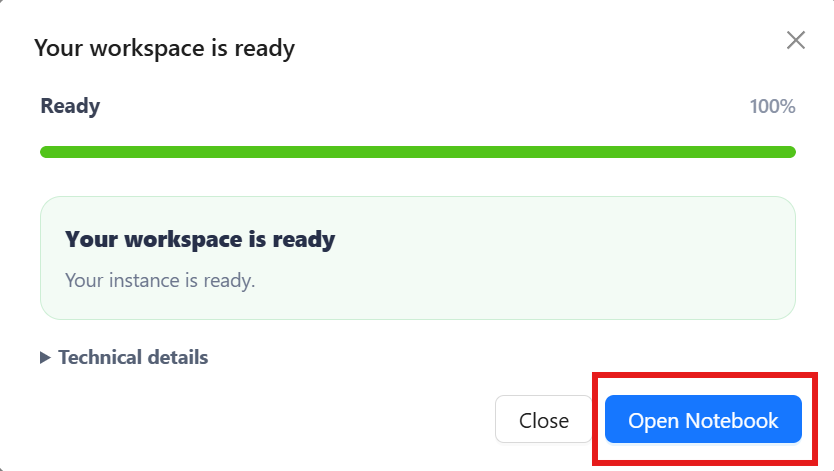

浏览器会在新标签页打开 **JupyterLab**——实例默认的访问入口。你在网页里就能拿到完整开发环境：

- **Terminal**：完整 Linux 终端（点顶部 `+` → Terminal，或 Launcher 里的 Terminal 磁贴），跑安装、下载、启动服务
- **Notebook（.ipynb）**：代码 + 输出混排的"活文档"
- **文件管理器**：左侧上传/管理文件（点上传按钮 `↑` 可传入自己的 `.ipynb`）

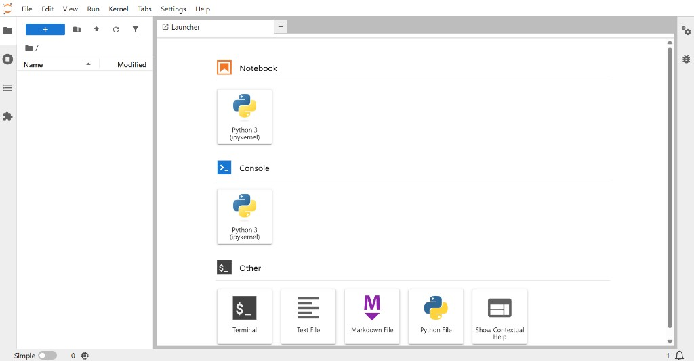

### 方式 B · SSH

**① 在 Profile 里添加 SSH 公钥**

- 本地生成密钥对（已有可跳过）。macOS / Linux / Windows PowerShell：

  ```bash
  ssh-keygen -t ed25519 -C "your_email@example.com"
  ```

  默认生成 `~/.ssh/id_ed25519`（私钥）和 `~/.ssh/id_ed25519.pub`（公钥）。

- 复制公钥内容（`cat ~/.ssh/id_ed25519.pub`），粘贴到 Profile 页 **SSH Public Key** 输入框，点击 **Save Key** 保存。

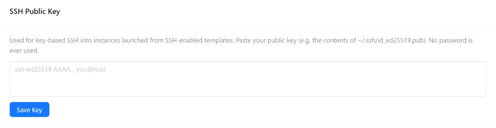

> ⚠️ 只粘贴 `.pub` **公钥**，绝不要粘贴私钥。

**② 在 Add Template 里开启 SSH Access**

创建模板时（Step 2），把表单底部的 **SSH Access (advanced)** 开关打开，再点 Add Template。只有 SSH-enabled 的模板启动的实例才能用 SSH 连接。

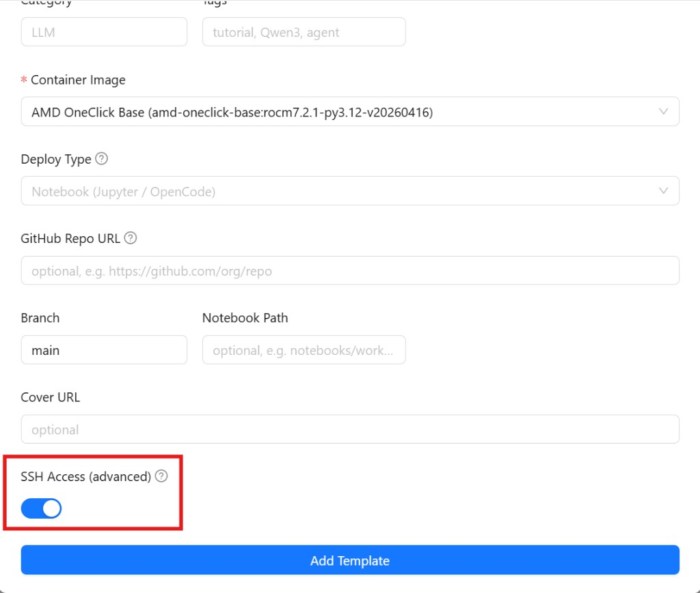

**连接实例**

1. 实例启动后，就绪弹窗（以及 Profile 的 **Active Instance**）里会显示 **SSH access**——直接给出可一键复制的 **Command** 和 **Host : Port**（主机地址、端口、用户名，以页面显示为准）。

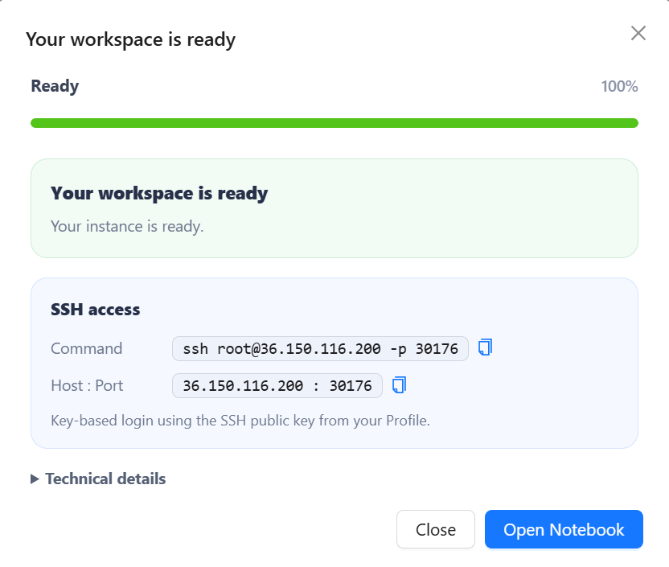

2. 本地终端连接：

   ```bash
   ssh <user>@<host> -p <port>
   ```

   把 `<user>`、`<host>`、`<port>` 换成实例详情里显示的实际值；首次连接提示确认指纹时输入 `yes`。

---

## ⭐ Step 5 · 用完销毁实例

实例在运行就会持续消耗额度。用完在 Profile 的 **Active Instance** 区域，点红色的 **Destroy Instance** 按钮销毁实例。

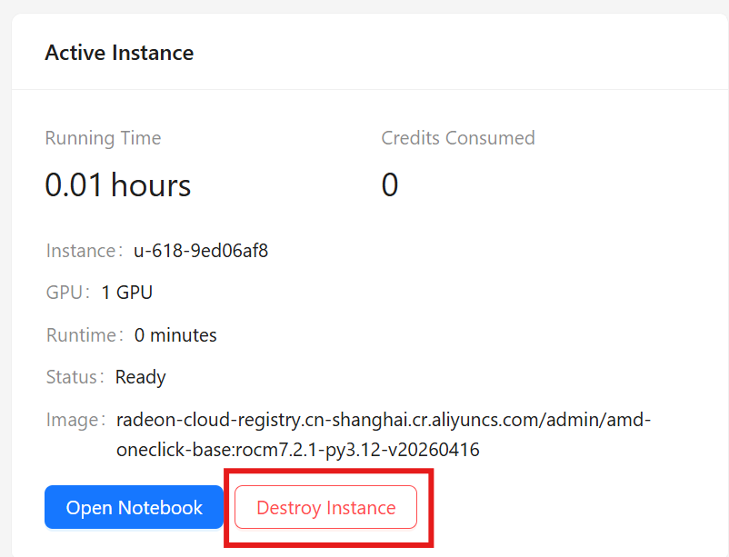
